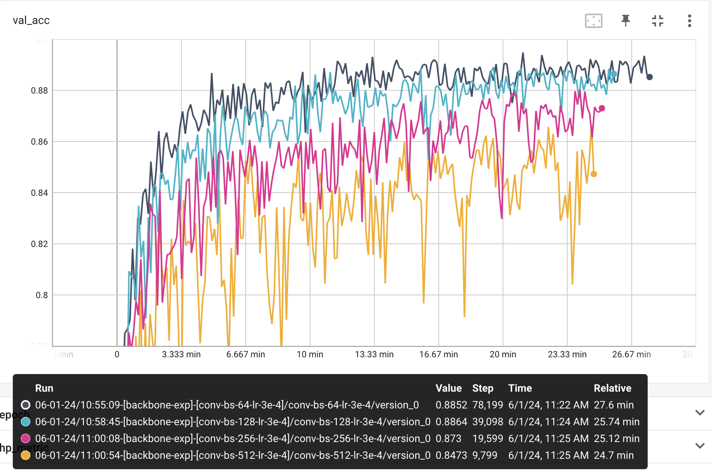

# cifar10图像分类

本报告在cifar-10上进行图像分类的实验，主要进行的实验如下以及结果如下

NOTE：我上传了tensorboard的log可以自行进行可视化

## 不同学习学习率的影响

使用不同的学习率各运行1000 step后的结果如上所示，这里的网络架构为conv-bn-relu无skip connection，可以看出1e-3太大，loss不下降，一个epoch后的val结果仍是acc=0.1与随机相同，其余的3e-4和5e-4都处于一个正常范围内，3e-4在一个epoch后的val acc稍好一点。

使用不同的学习率运行30k step后的val acc结果如上，这里的网络架构为conv-bn-relu加skip connection，可以看出（1）不同的学习率的缺回答来精度的影响（2）加了skip connection后网络的确更好优化，同为lr=1e-3，无skip connection无法训练，有skip connection则好训练。

## 使用不同的normalization layer

可以看出在图像分类任务上，batch norm，layer norm，group norm都能取得较好的效果，instance norm和没有batch norm则会显著影响精度。

## vit在cifar10上的结果

可以看出直接使用vit进行图像分类的效果较差，将vit的patch embedding换成几层conv后能够显著的使得优化更好，但是离CNN还是有一定差距，因此要将vit直接用于图像分类需要进行足够的预训练。

## 不同的lr scheduler及optimizer

可以看出step-lr在减小lr的step处会有较明显的精度提升，cosine lr 则是相对平缓，同时adamw相对于SGD的确优化的更好。

## 不同batch size

设置epoch数为相同的100，batch size分别为64，128，256，512，则对应的step数相应的减少，不同batch size设置的学习率都相同，可以看出从step数的角度来看，虽然都是100ep，batch size=512，在100ep结束后与batch size=64在对应step处精度大致相同。

将x轴调为时间，可以看出，当batch size更大时，GPU的利用率相对更好，同样运行100ep的更快，花的时间更短，但是由于更新的step数较少，所以精度也更低。

当我把batch size=512的实验的ep调大至800 epoch，使得它更新的step数与batch size=64相同时，它们的精度差不多，batch size更大的由于gradient更加精准，因此性能相对更稳定。但是注意此时batch size=512花了更多的时间，几乎是4倍的运行时间。

当我把lr根据batch size进行linear的scale，可以看到batch size=512由于batch size更大，GPU利用率更高，运行时间更快，精度也能够与小batch size相当。当我们在很大的数据集上进行DDP的训练时，便可以通过多卡的方式，增大batch size，减少运行时间，同时使得准确率不损失太多。

## 对模型进行scale

模型都是通过两个conv-bn-relu进行堆叠形成一个stage，stage的通道数变化为32-64-128-256-256，最后进行图像分类，现在我将每个stage的2xconv-bn-relu的数量分别设为1，2，4，6。可以看到当1→2精度升高，2→4, 4→6精度均下降，可以看出naive的scale model并不会得到很好的效果，加入skip connection后，6+skip connection的精度上升，然而仍然低于2的设置。本实验设置稍有问题，因为每个stage的卷积数其实应该设置为不同的值的。

## bn对模型的影响

当网络不是太深时，没有batch norm会导致精度的下降，以及优化速度的变慢，当网络足够深时，没有bn则网络根本无法进行有效训练。

# Reference

1. Accurate, Large Minibatch SGD: Training ImageNet in 1 Hour
2. Batch Normalization: Accelerating Deep Network Training by Reducing Internal Covariate Shift
3. Early Convolutions Help Transformers See Better
4. Deep Residual Learning for Image Recognition